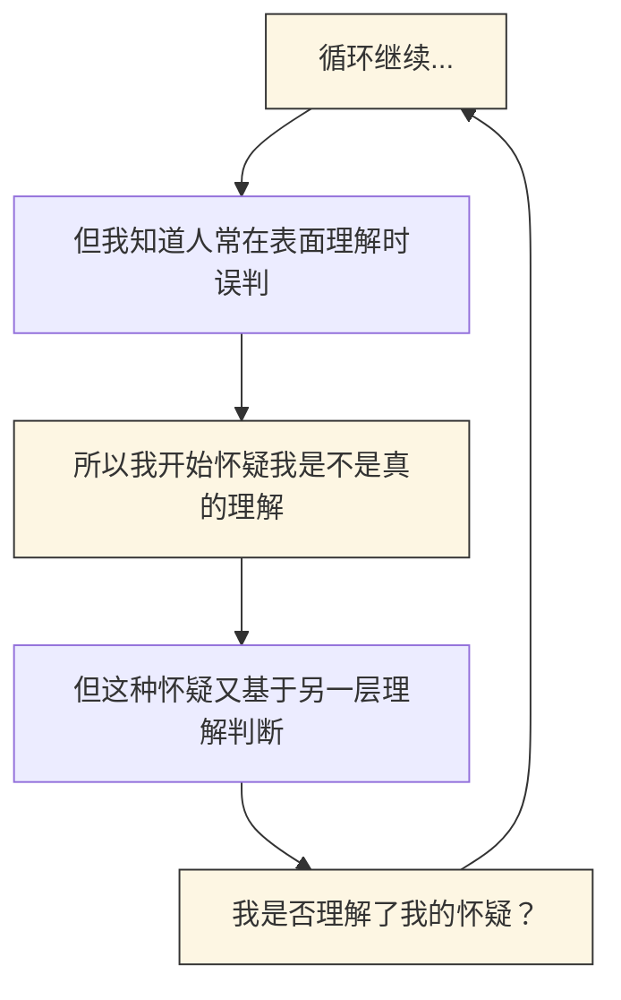
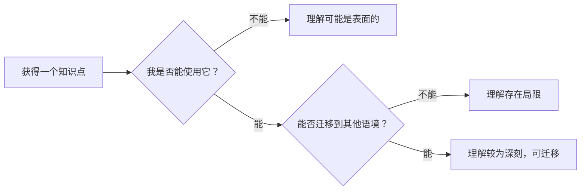

# 理解的悖论：我们真的知道自己懂了什么吗？

## 摘要

人类理解世界的过程并不只是信息的积累，更是一种对“我们是否真正理解”的自我判断。但讽刺的是，这种判断常常本身就处在一种认知的盲区之中。我们如何知道自己已经掌握了一个概念？我们如何确定这种“感觉上的掌握”并不是一种幻觉？本文试图探讨这样一个悖论性的过程：认识自己是否真正理解，是一种深陷于主观和客观之间张力的过程——你以为你知道，但你并不确定你是否真的知道。

---

## 1. 理解的幻觉：当“能做”误导了“已懂”

在现代教育和自学中，一个常见的现象是：**表层操作能力让人误判了知识的掌握程度**。这在技术学习中尤为常见。

> **技术类例子：**
> 初学 Python 的人往往能快速上手写出一些小脚本，如爬虫或小游戏。这种即时反馈带来强烈的“我会编程”的错觉。但真正涉及数据结构、时间复杂度、设计模式或系统架构时，他们才会发现自己的知识像纸片一样单薄。

同样的幻觉也存在于日常生活：

> **生活类例子：**
> 学会几个单词就觉得自己会英语；会做几个菜就觉得自己精通厨艺；第一次健身后肌肉酸痛就觉得“锻炼到位”了……这些都是“初步操作成功”带来的认知假象。

心理学上，这种效应有名称：**达克效应（Dunning–Kruger Effect）**。研究者发现，**认知能力较低的人往往高估自己的理解程度**。但更微妙的是，这个效应也发生在聪明人身上：**越是刚接触一个领域，越容易因为短期成功而自信过头。**

---

## 2. 理解的元悖论：如何判断“我是否真正懂了”？

人类的理性有一个根本限制：**我们依赖主观感觉来判断自己的知识状态**。而这种判断机制本身是不可靠的。

> 你觉得你理解了，是因为你“感觉”你理解了。  
> 但这种感觉本身可能只是因为你没有意识到你不知道什么。

这就是哲学上的“**元认知悖论**”：  
> **判断我是否知道，是建立在我认为我知道如何判断“知道”的基础上。**

如果用波普尔（Karl Popper）的语言来说，这种“自我确证”是不科学的，因为：
- **知识必须能够被质疑、被证伪，才算是真正可靠。**
- 而我们对自己的理解状态，却缺乏这种“可证伪性”。

这意味着：**我们无法通过内省来确认我们是否真正理解了某件事。**

---

## 3. 理解即使用：维特根斯坦与实用主义的视角

那我们应该如何判断“真正理解”呢？哲学家维特根斯坦在《哲学研究》中提出了一种非常具有启发性的观点：

> **理解不是一种“心理状态”，而是一种“语言游戏”——你能否在实际语境中使用一个概念。**

换言之：
- 不是你能否复述定义，而是你是否**知道何时、如何、为何使用这个知识**。
- 真正的理解，体现在使用中、误用中、修正中。

与此相呼应，美国实用主义哲学家约翰·杜威（John Dewey）也认为：
> **知识的价值在于“解决问题的能力”，不是逻辑的完整性。**

所以，我们不应问“我懂了吗？”  
而应问：“我能用它解决问题吗？”、“我能用它解释别的事吗？”、“我能用它创造新的东西吗？”

---

## 4. 案例对比：知识迁移的实与虚

> **例一（正迁移）：**
> 你精通一门 OOP 语言（如 Java），因此很快能上手 Python、C++、C#。说明你对“类、对象、继承、多态”的理解是可迁移的——你不仅知道它的定义，还知道它在不同语境中的表现。

> **例二（误判迁移）：**
> 你会使用 `sklearn` 拿数据跑出一个机器学习模型，于是自认掌握机器学习；但在面临无封装库时无法推导模型公式，或者面对偏态数据时无法诊断问题，说明你掌握的是工具，而不是原理。

前者体现的是“可迁移的深层理解”，后者是“操作层的幻觉理解”。

---

## 5. 结语：怀疑不是软弱，而是理解的前提

我们或许永远无法消除“我以为我懂”的错觉，但我们可以：
- **保持对自己理解状态的谦逊；**
- **用“是否能迁移使用”来检测理解的真实性；**
- **接受“理解是不断演化的过程”，不是一次性完成的仪式。**

正如维特根斯坦所说：

> “意义存在于使用之中。”（*The meaning of a word is its use in the language.*）

我们所理解的，不是静态的“知识对象”，而是在与世界互动中动态生成的**认知工具**。

---

> “理解不是知识的终点，而是怀疑的起点；  
> 真正的懂，是你敢在误解中前行的那份勇气。”  
> —— 从未完全懂，但一直在成为更懂的路上。

