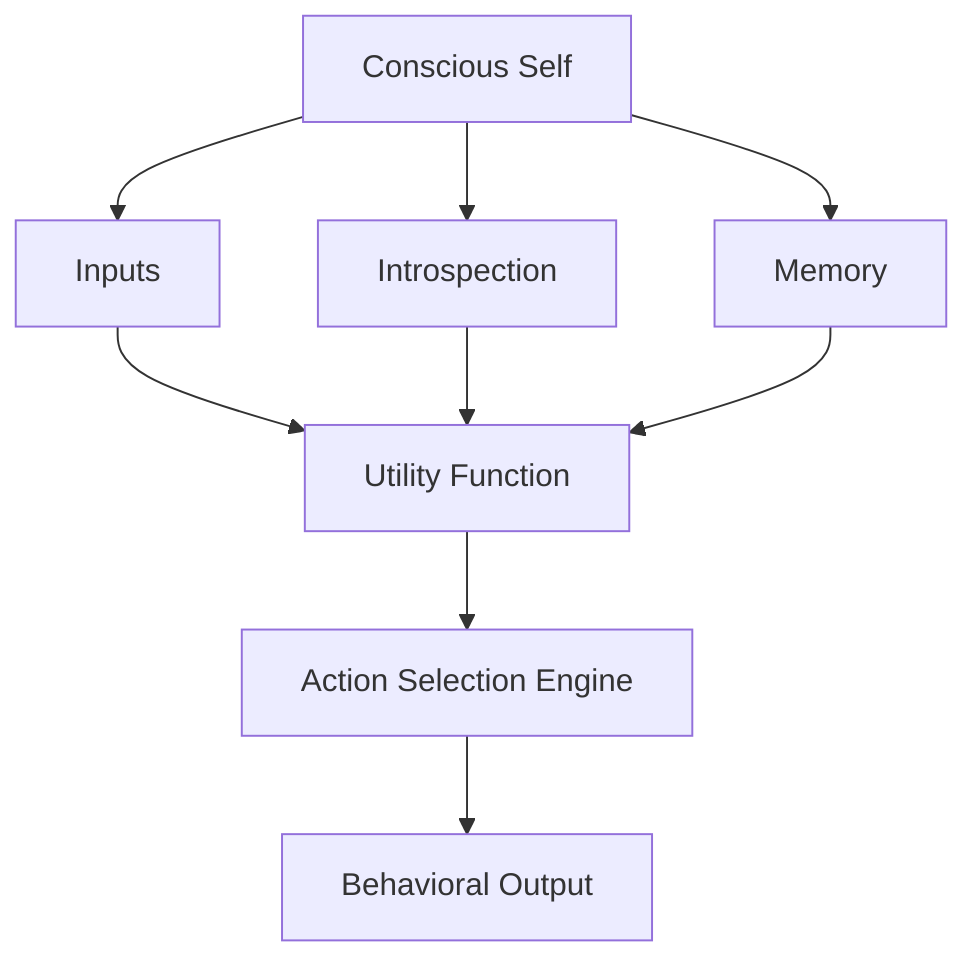
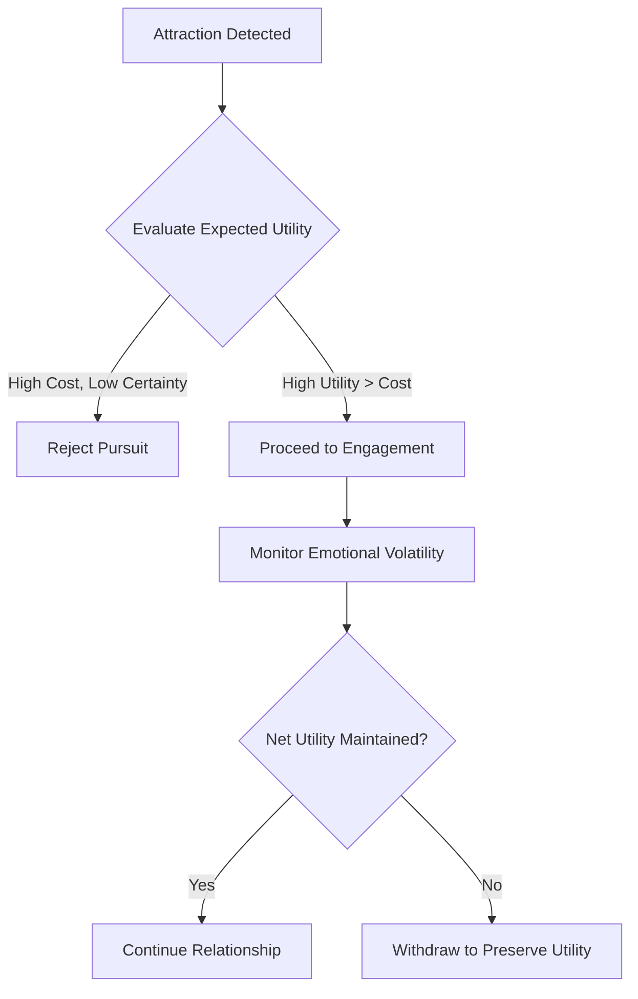

**Title:** The Structure and Implications of Individual Utilitarianism: A Rationalist Philosophy of Self-Centered Value Maximization

**Abstract:**
This paper explores a philosophical framework termed "Individual Utilitarianism" (IU), which emerges as a rationalist reinterpretation of classical utilitarian thought. Unlike traditional utilitarianism, which seeks to maximize the happiness of all affected parties, IU confines moral and pragmatic evaluation to the conscious individual's subjective utility. The model is internally consistent, logically rigorous, and applicable in both ethical theory and cognitive modeling. This paper defines IU's theoretical foundation, contrasts it with classical utilitarian ethics, examines its psychological plausibility, and demonstrates its implications through hypothetical examples.

---

**1. Introduction**

Classical utilitarianism, as articulated by thinkers such as Jeremy Bentham and John Stuart Mill, is grounded in the ethical imperative to promote the greatest happiness for the greatest number. In contrast, Individual Utilitarianism (IU) posits that ethical obligation and value assessment reside exclusively within the conscious experience of a single individual. From this perspective, others are not denied ontological existence but are functionally treated as environmental elements that influence the individual's utility curve. This paper proposes a structured examination of IU as a coherent but highly individualistic value-maximization philosophy.

---

**2. Core Premises of Individual Utilitarianism**

Individual Utilitarianism rests on five central propositions:

1. The conscious self is the sole evaluator of value and moral relevance.
2. All external agents are functionally reduced to utility-relevant phenomena.
3. Every decision is assessed based on its anticipated effect on the self's cumulative happiness or utility.
4. Utility is quantifiable in subjective terms and modifiable via introspective metrics.
5. Emotional states are instrumental variables, capable of being repurposed for utility-optimizing behavior.

For instance, one could maintain a melancholic emotional tone not as a response to environmental loss, but as a deliberate cognitive state to suppress impulsive distractions and focus on academic or professional output.

**Figure 1.** Structural Model of Individual Utilitarian Decision Logic (Mermaid Syntax):

This diagram visualizes how external and internal inputs are filtered through a central utility function governed solely by the conscious self, producing behavior optimized for subjective utility.

---

**Figure 2.** Utility Evaluation in Romantic Decision-Making (Mermaid Syntax):

This diagram models how an Individual Utilitarian might process the decision to pursue or maintain a relationship strictly in terms of expected subjective utility.

---

**Figure 3.** Marginal Utility and Rotational Preference Strategy (Mermaid Syntax):

This figure represents how Individual Utilitarianism anticipates diminishing returns on repeated pleasures, prompting behavioral rotation to preserve long-term utility.

---

**3. Contrasts with Classical Utilitarianism**

| Dimension                | Classical Utilitarianism       | Individual Utilitarianism         |
|-------------------------|--------------------------------|-----------------------------------|
| Moral Scope             | Collective happiness           | Individual subjective happiness   |
| Unit of Value           | Aggregated welfare             | Conscious self only               |
| Emotional Role          | Morally significant            | Behaviorally instrumental         |
| Other Persons           | Moral equals                   | Utility-modifying entities        |

IU thus diverges from classical frameworks by removing the necessity of altruism or interpersonal empathy. Under IU, ethical merit is not invalidated by social disapproval or interpersonal harm unless these reduce the self’s perceived net utility.

---

**4. Psychological Plausibility and Strategic Logic**

From a psychological perspective, IU aligns with cognitive-behavioral theories that prioritize internal reinforcement over social validation. For example, an individual faced with the decision to engage in a romantic relationship may assess it not on emotional desirability or normative expectations, but on projected costs, including time expenditure, emotional volatility, and opportunity costs. Unless the expected gain in subjective well-being outweighs these factors, abstention becomes the utility-maximizing strategy.

Similarly, behavioral economics recognizes that individuals often convert negative emotional states into productive energy. For instance, a student might channel frustration into concentrated study, thereby raising long-term utility despite short-term discomfort.

---

**5. Theoretical Strengths and Limitations**

**Strengths:**
- **Clarity of Decision Framework:** Individuals can operate under clearly defined internal metrics.
- **Emotional Efficiency:** Emotional states are filtered through utility functions, reducing impulsive behavior.
- **Systemic Adaptability:** Especially suited for high-pressure domains where decisiveness and optimization are valued.

**Limitations:**
- **Ethical Insularity:** The model may be ethically unpalatable in societies that value empathy, altruism, or moral universality.
- **Interpersonal Fragility:** Sustained human relationships may suffer due to low prioritization of others’ intrinsic value.
- **Existential Risk:** As the model does not inherently provide ontological meaning, users may confront nihilism if utility mechanisms fail or stagnate.

---

**6. Applied Implications and Ethical Tensions**

Individual Utilitarianism presents a distinct set of applications in fields such as artificial intelligence, where agents might be programmed to optimize internal reward functions independent of social harmony. For example, an autonomous agent designed to maximize its own reward metrics might disregard moral conventions unless they correlate with algorithmic gains. In human contexts, IU might describe strategic actors in corporate, military, or political arenas, where personal advancement is pursued with minimal ethical friction.

This approach also invites comparison to ethical egoism and certain strains of existential individualism, though IU is distinguished by its algorithmic and quantifiable structure.

---

**7. Conclusion**

Individual Utilitarianism is a coherent and highly structured system for value assessment and decision-making centered entirely on the subjective consciousness of the individual. While it departs significantly from collective moral theories, its internal logic, psychological resonance, and applied potential render it a noteworthy paradigm for further philosophical and practical investigation. It challenges traditional ethical norms by reframing all action as self-referential utility optimization—a shift that raises profound questions about the nature of morality, meaning, and human coexistence.

---
