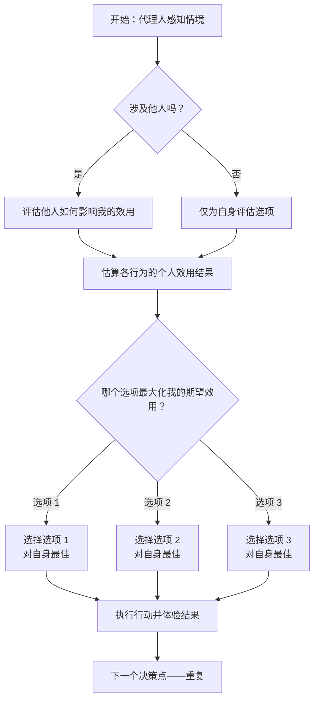

# 个人效用主义：一种以理性为基础的自我导向道德认知模型

## 1. 摘要

**背景：** *个人效用主义*（Individual Utilitarianism，简称 IU）是一种规范性框架，主张道德价值和决策应完全以最大化个体自身的主观效用或幸福感为核心。该框架与**经典效用主义**（即将所有个体的福祉进行加总）背道而驰，它不将他人视为拥有内在道德价值的平等主体，而是视为能影响行动者个人效用的外部因素。IU 将道德情感和社会考量重新定义为*工具性变量*——它们仅作为个体内部效用计算的输入信息，而非独立的伦理义务。

**目标：** 本文系统阐述了个人效用主义的理论结构，并将其置于哲学语境之中。我们概述了 IU 的核心原则、形式结构和决策程序，并使用 *Mermaid* 语法绘制概念图进行说明。随后，我们将 IU 与几种主要伦理理论进行比较：包括经典效用主义的无私立场、康德式义务论、传统的伦理利己主义，以及存在主义对自我与他人的看法。我们还探讨了 IU 的心理和行为影响，将其理性主义方法与认知行为理论和决策科学中的发现联系起来（例如情绪和*主观幸福感*的建模）。我们识别出 IU 面临的潜在漏洞，例如不可证伪性、他人意识的不可透视性，以及对道德的简化理解，并讨论 IU 支持者可能的回应。最后，我们探索 IU 在人工智能（AI）和自主代理等应用领域的潜在意义，分析自我导向型效用最大化模型对 AI 行为的影响，既揭示其结构清晰、决策一致的优势，也警示其在目标对齐与社会冲突中的风险。

**结论：** 本文认为，个人效用主义提供了一种以理性为核心的道德认知模型，强调个体对自身生活的审慎推理。它揭示了伦理学中个体视角与集体视角之间的深层张力。尽管在哲学上具有挑战性并自洽一致，IU 也面临重大难题：它颠覆了关于道德平等与利他的常识直觉，并难以解释人际道德义务。在 AI 等应用场景中，若无约束，一个纯粹以自我为中心的效用最大化代理体可能具有极高风险。我们以总结 IU 的哲学意义和提出尚待解决的问题作结，例如：道德推理是否真能完全简化为理性的自利考量？IU 能否在现实中与社会伦理整合或调和？

## 2. 引言

经典效用主义由边沁（Jeremy Bentham）和密尔（John Stuart Mill）提出，其核心原则可概括为“为最大多数带来最大幸福”（Bentham, 1789）。该理论具有**普遍性**和**无私性**：每个人的福祉在道德计算中被平等对待（Mill, 1863）。边沁名言“人人一份，不多不少”体现了效用主义的*行动者中立性*——在道德决策中，自己的利益并不比他人的利益更重要（Bentham, 1789，第4章）。换言之，经典效用主义要求道德行动者**无偏地考虑所有相关个体的效用**（Driver, 2014）。正当的行为是指能够最大化*整体善*（即所有人幸福总和）的行为。

与此形成鲜明对比的是，**个人效用主义（IU）**主张一种*以自我为中心*的道德框架，在该框架下，**只有行动者自己的主观效用才具有内在价值**与道德权重。个体的目标是最大化其在时间维度上的*个人幸福与福祉*，而他人仅作为能影响其体验和结果的环境因素进入分析。从本质上讲，在 IU 看来，他人是从个体意识出发的*“效用修正现象”*，而非拥有独立道德权利的对等存在。该立场继承了效用主义的结果论结构（依据后果与效用进行决策），但将其适用范围严格限定于个体自身。因此，个人效用主义可被视为一种*利己主义版本*的效用主义——一种将**最大化个人效用**视为行为正当性标准的理论。

IU 的提出立刻引发了诸多质疑与挑战。首先，人们可能会问：一个对他人全然漠视的理论是否还能称为“效用主义”乃至“道德理论”？传统定义中，效用主义强调对所有人福祉的无偏关注（Driver, 2014；**斯坦福哲学百科**，2014）。而 IU 则公开拒斥无私性：它**绝对地优先考虑行动者自身视角**，将一切价值归结为其对行动者个人利益的贡献。由此，IU 与*伦理利己主义*一致，即认为一个人应当将自身福祉作为唯一的内在善（Regis, 1980）。然而，IU 同时试图保留一种**系统化、理性的决策程序**，类似于效用主义计算。它并不提倡任意的自私行为，而是一种以**理性选择**为基础、致力于*长期幸福最大化*的行动方针，甚至可能应用成本收益分析于一切个人决策。因此，该理论可被视为一种*面向单一行动者的理性道德认知模型*。它借鉴效用主义的结构（依据效用函数评估后果），但将该函数的定义域限制在个体一生。这引发了一系列复杂问题：IU 如何处理与他人的互动（合作、同理、冲突）？它如何将诸如内疚、同情、责任等道德情感重新解释为纯粹工具性因素？它能否避免早期利己主义理论所遭的经典批评，如*不可证伪性*或无法解决利益冲突（Popper, 1963；Rachels, 2003）？

本文将通过系统阐述与分析，对上述问题予以回应。我们首先详尽阐述 IU 的理论框架，包括其核心原则以及道德推理模式。我们展示 IU 的决策模型和逻辑，解释它如何将**情感**与社会信息转化为个体*效用计算*的输入。为便于理解，我们将使用 **Mermaid 图表**以可视化方式展示 IU 个体的认知过程。

接下来，我们将 IU 与四种主要哲学视角进行比较：

- **经典效用主义：** 比较 IU 的以自我为中心的效用最大化方式与边沁和密尔的无私集体最大化方式，分析 IU 如何变革传统效用主义范式；
- **义务论伦理学（康德主义）：** 分析 IU 与义务论（特别是康德所提出的“人是目的”的命令）的关系，并讨论 IU 可能导致的“把他人仅作为手段”的后果；
- **伦理利己主义：** 将 IU 与标准的伦理利己主义以及理性利己主义（如安·兰德、霍布斯的观点）进行比较，评估 IU 是否只是换个说法的利己主义，及其是否能规避后者的弊端；
- **存在主义：** 由于 IU 极度强调个体，我们探讨其与存在主义思想之间的联系，如其是否可视为某种形式的“自我价值创造”，以及它是否与存在主义强调的真实性或人与人之间的冲突相矛盾（Sartre, 1943）。

在完成哲学比较后，我们将深入探讨 IU 的**心理与行为学意义**。这一部分将 IU 模型与心理学和决策科学的研究成果相连接。例如，IU 专注于最大化*主观幸福感*，因此我们需要理解幸福如何被测量（Diener, 1984），以及人们实际上是如何追求幸福的。我们援引**认知行为理论（CBT）**讨论 IU 行动者如何调节情绪与信念，以维持对个人效用的理性追求（Ellis, 1957）。在 IU 中，情绪具有关键作用：内疚或同情等情感可以被视为进化或社会机制产生的*启发式规则*，一般能推动亲社会行为，但 IU 个体必须将它们视为关于个人后果的信号（例如：“帮助他人让我内心获得满足，从而提升了我的效用”；或“内疚是一种负面体验，因此为了内心平静，我或许应避免某些行为”）。我们评估一个具备强烈社会性与同情心的人是否真能按 IU 生活，以及这种行为模式将会如何体现。

随后，本文将严肃审视 IU 所面临的**哲学漏洞**。每种伦理理论，特别是具有争议性的，都难免遭遇批评。对 IU 来说，主要质疑包括：
- **不可证伪性与琐碎性：** 类似心理利己主义的批评，有人指出 IU 是*不可证伪的*，因为它可以将任何行为重新描述为出于某种个人满足，从而逃避经验验证（这一经典批评见 Batson, 1991）。我们将探讨 IU 是具有实质性的规范主张，还是仅是一种动机分析的重述；
- **人际不可透视性与孤立：** IU 可能意味着某种形式的独我论或至少是*道德孤立*——既然它只重视自身感受，那么他人内部体验在其框架下便完全无关。这是否使道德沟通和共识成为不可能？IU 个体如何应对“他人也视自己为价值中心”的现实？
- **简化主义：** IU 是否过度简化了道德的复杂性（例如权利、正义、美德、社会关系等），将一切压缩为一个人的福祉？我们将探讨是否有重要的道德观念在这一简化中被遗漏；
- **冲突解决能力不足：** 传统伦理往往提供个体之间冲突的解决机制。而伦理利己主义常因无法有效调解利益冲突、只能依赖暴力或协商而受批评（IEP, n.d.）([Egoism | Internet Encyclopedia of Philosophy](https://iep.utm.edu/egoism/#:~:text=conflict,conflict%2C%20and%2C%20a%20solution%20to))。我们将探讨 IU 是否因为仅考虑一个立场，天然地缺乏调解冲突或避免零和博弈的机制。

在倒数第二部分，我们探讨 IU 的**应用意义**，尤其是在人工智能领域。随着 AI 系统与自主代理体在现实中扮演越来越多的角色，其背后的目标结构变得至关重要（Russell, 2019；Bostrom, 2014）。若将 IU 原则应用于 AI，其实质将是一个**自私型效用最大化体**——这在缺乏约束时，可能发展为类似“回形针最大化器”（Bostrom, 2003）这一思想实验中那种极端不理性的行为。我们将引用 Omohundro（2008）提出的*基本 AI 驱动因素*，例如自我保护与资源获取，展示它们如何与 IU 行动者的单一目标行为平行。我们进一步讨论：将 IU 编入 AI（即只关注其自身奖赏信号）是否合理或危险，尤其是在 AI 对齐问题中。同时，我们也从安全角度提出正向设想：理解 IU 原则有助于在设计 AI 时明确知道，如果它只关注自身效用，它会如何将人类工具化——因而可能促使设计者刻意加入超越自利的伦理限制。

最后，我们对 *个人效用主义* 作为哲学模型进行评估。我们总结 IU 如何对理性与道德本质的探讨做出贡献，并指出尚待解决的开放性问题。IU 是一种有说服力的规范理论，还是仅仅是某些人行为方式的描述？一个由个人效用主义者组成的社会能否运转，抑或会陷入冲突与混乱？IU 是否可能与传统道德体系实现调和——也许形成一个更广泛的框架，既承认理性自利，又认可他人的内在价值？这些问题构成了未来伦理学、心理学与理性决策理论交汇点上的研究方向。

总之，本引言勾勒了个人效用主义的核心主张及其哲学意义。下文将对这些思想进行深入阐释。我们的目标是在文章结束时，既清晰说明“以理性为基础的自我导向道德认知模型”意味着什么，也公正评估其在理论与实践上的优缺点。

## 3. 个人功利主义的理论框架

在本节中，我们阐述个人功利主义（Individual Utilitarianism，简称 IU）的理论框架，明确其基本**原则**、*推理结构*以及所涉及的决策程序。我们还提供了一个视觉示意图（采用 Mermaid 图表形式），以展示基于 IU 的认知过程如何运作。这一正式阐述将清晰地说明 IU 模型对道德认知和行为的主张。

### 3.1 个人功利主义的核心原则

个人功利主义可以通过一组核心原则或公理来定义，这些原则体现了其规范立场。我们可以将这些原则列举如下：

1. **主观效用为唯一价值：** 在 IU 中，*唯一*的内在价值是个体代理人的*主观效用*（幸福、福祉或满足感）。所有结果都根据其如何影响代理人自身的有意识体验来评估。该原则呼应了古典功利主义对效用的关注，但将其限制于单一主体。从哲学上讲，这种立场是一种**审慎价值一元论**——只有代理人的利益才被计入（Sidgwick，1874；Parfit，1984）。

2. **结果主义决策规则：** IU 是结果主义的，即行动的正确性完全由其对代理人效用的结果决定。当 IU 代理人面临选择时，会预测或估计每个选项对自身的预期效用，并选择使该预期效用最大化的行动。形式上：*当且仅当行动 $A$ 导致的结果对代理人的主观效用至少与任何其他可用行动相当时，行动 $A$ 对代理人来说是道德上正确的*（类似于古典功利主义的标准，但限制为单一效用函数）。这使得 IU 成为一种**工具理性**的规范理论：道德选择与实现自身福祉的最优工具理性相一致（冯·诺伊曼 & 摩根斯坦，1944；SEP，2023）。

3. **情感和社会输入作为工具：** 人类代理人不会在真空中计算效用；我们有情感、本能和社会倾向，这些部分是为处理与他人的互动而进化的。IU 承认这些心理因素，但将它们视为*工具性*的。也就是说，情感（同理心、内疚、爱、愤怒等）和道德直觉不被视为独立的权威或道德真理；相反，它们是可以为效用计算提供信息的*启发式或变量*。例如，同理心可能导致 IU 代理人在看到他人受苦时感到痛苦，因此如果她导致或目睹了痛苦，她自身的效用会降低。IU 会说，代理人应考虑他人的痛苦，仅仅是因为这会影响她自己（例如通过同理心或未来的影响），而不是因为他人的痛苦具有内在的不良价值。我们可以称这一原则为**情感工具主义**——情感是关于代理人自身福祉的数据输入（Frank，1988，关于情感的战略作用）。

4. **他人作为效用因素，而非目的：** 在 IU 中，其他人和道德主体本身并非目的（与康德伦理相反）。相反，他们是代理人环境的一部分，可以正面或负面地影响代理人的效用。如果代理人关心他人（例如，友谊带来快乐，或看到他人受苦引起痛苦），或者善待他人会带来互惠利益，那么他人的幸福可能对 IU 代理人重要。但这些关注是*派生的*。这一原则明确将 IU 与康德的**人性公式**对立起来（“行为要使人性……始终作为目的，而不仅仅是手段”；康德，1785）。IU 设计上将他人**仅仅视为手段**（为代理人的幸福），尽管如果善良能带来更好的个人结果，通常是*仁慈的手段*。重要的是要强调：IU 并不必然意味着残忍或冷酷——帮助他人可以成为个人福祉的最优策略的一部分（因为社会合作可以带来个人回报）。然而，它否认除了代理人自身的效用增益之外，还有任何额外的道德理由来帮助他人。

5. **终身福祉最大化：** IU 通常假设对效用的长期或**累积视角**。这不仅仅是即时满足；而是最大化代理人*一生中的累积*或*效用积分*。这与最大化自我所经历的*总*（或可能是平均）福祉的理念一致。在实践中，这意味着如果短期牺牲能带来更大的长期收益，则可以被证明是合理的（经典的审慎权衡）。例如，IU 代理人可能现在忍受不适或投入努力（如努力学习，或帮助朋友以期获得回报），如果这增加了未来更大幸福的可能性。该原则将 IU 与**理性审慎**的概念联系起来——代理人将未来的福祉视为（几乎）与当前福祉同等重要，反映了对自身生命的时间中立性（Sidgwick，1874；Parfit，1984）。形式上，代理人可能被视为在其一生中最大化积分 $\int_0^T u(t) dt$，如果他们不太耐心，可能会对未来效用有折扣因子。

6. **内部效用计算：** IU中的决策过程常常被理解为类比于*内部计算器*或深思熟虑的推理，权衡自我的利弊。这并不意味着IU代理人必须在每个决策中明确进行数学运算；相反，它假设他们的选择有一个潜在的逻辑（最大化个人期望效用），无论是显式还是直觉地进行。在复杂决策中，IU原则上可以借助正式决策理论（例如，计算期望值，使用概率处理不确定结果，如**期望效用理论**（Savage, 1954；SEP, 2023））。关键是，至少作为一个理想，IU代理人*始终如一地应用*“我的效用最大化”这一标准于所有选择。这将IU与更任性的自私行为区分开来；它渴望成为**系统和理性**的。它可能会拒绝短期诱惑或冲动欲望，如果这些欲望不利于长期效用——因此，它并不提倡在当下随心所欲，而是在理性反思后做出真正有利于自己的选择。

总结这些原则：个体功利主义假设一个以一个理性代理人为中心的世界，她寻求在时间的推移中最大化自己的幸福，纯粹将所有可用信息（包括情感反馈和对他人的知识）作为实现这一目标的输入。在这种观点中，道德归结为一个问题：“我该做什么才能让我的生活尽可能顺利？”——这是一个谨慎和理性自利的问询，提升到唯一伦理标准的地位。

### 3.2 IU 决策结构（Mermaid 图表）

通过可视化展示个人功利主义代理人如何进行决策是非常有帮助的。下列 Mermaid 流程图逐步说明了 IU 原则指导下的认知过程，从感知情境到采取行动：

**图 1：个人功利主义决策流程图。** 此图展示 IU 代理人如何反复进行决策的过程。代理人从**感知情境**（A）开始。如果他人无关（B：“涉及他人？否”），代理人仅根据对自身的直接影响来评估选项（C）。如果涉及他人（B：“是”），则评估他人如何可能影响她的效用（D）——例如他人的反应、未来回报、情感反应如同理或内疚。无论哪种情况，代理人接着估算各行为可能带来的个人效用结果（E）。然后，代理人确定哪个选项对自己来说具有最高的预期效用（F），并选择该选项（G、H 或 I）。选择的行为被实施，产生结果，代理人体验该结果（Z）。这引出新的情境，流程重复。关键是：F 节点的*唯一标准*是代理人自身的预期效用。他人影响仅通过 D 被纳入考量（即如何反作用于代理人的福祉）。整个循环（A -> … -> Z -> A2）代表生活决策的持续性。IU 规定在每一个节点上，代理人应应用此效用最大化程序。

在流程图中，步骤 D（“评估他人如何影响我的效用”）体现了 IU 对社会因素的立场：代理人可能思考，*“如果我做 X，Y 可能会受伤——这会让我**感到如何**？是否会让我烦恼或带来未来麻烦？相反，如果我帮助 Y，我会感到快乐或获得好感吗？”* 所有这些考虑都被转化为代理人效用结果中的加分或减分项。

尽管该过程较为抽象，但它简化地反映了日常推理方式。例如，设想一位 IU 代理人正在决定是否将一大笔款项捐赠给慈善机构还是留作己用。根据 IU：她会考虑捐赠让她的感受如何（也许对受益者的同情使她感到幸福，或若未捐赠会感到内疚）。她会权衡这一点与留住这笔钱所带来的快乐或安全感之间的差异。她会预测哪个选择在长远上能带来更大的净满意度（包括声誉收益或良心负担）。如果捐赠带来的心理满足和名誉回报超过失去金钱的代价，IU 会说 *捐赠*（因为这最大化了她的效用）；否则，IU 会说 *不捐赠*。注意，受赠者的*需求*只在它影响她的感受或未来时才有意义。古典功利主义者可能因受益人的福祉本身具有道德价值而捐赠；IU 代理人可能捐赠，但仅仅因为受益人的福祉对她*有意义*（也许是因为她重视同理心或社会认同）。

### 3.3 情感作为效用计算中的变量

IU 的一个显著特点是它对**情感和道德直觉**的处理。在许多道德理论中，同理心、同情、内疚或愤慨等情感被视为关键的道德动因或价值感知（例如，亚当·斯密的《道德情操论》，或现代道德心理学认为同理心是利他行为的基础）。IU 重新构想了这些情感，视它们为携带*效用权重*的内部现象。它们是代理人奖惩系统的一部分。例如：

- **同理心：** 如果看到某人痛苦也让代理人感到痛苦（这是常见的同理反应），那么*缓解他人的痛苦将减轻代理人自身的同理性不适*。从 IU 的角度看，帮助他人之所以“好”，是因为它止住了自己的不适。同理心有效地将他人的部分痛苦“导入”代理人的效用函数中。

- **内疚：** 如果代理人做了她认为（可能源于社会规范）是错误的事，并因此感到内疚，那么这种内疚就是她效用的下降。IU 代理人会避免那些引起强烈内疚的行为，并非因为它们“客观上错误”，而是因为她*个人*会因此遭受情绪上的痛苦。内疚在此扮演自我调节的负强化机制。

- **同情与爱：** 对他人的积极关注（如对家庭的爱）意味着代理人的效用深深绑定于所爱之人的福祉。对于真正爱着某人的 IU 代理人而言，确保那个人的幸福本质上就是她自身幸福的一部分。在这种情况下，IU 可以为看似无私的行为提供理由：比如母亲为孩子牺牲，因为她的福祉与孩子的福祉紧密相关。然而关键在于，IU 将这种行为视为*扩展的自我利益*（孩子的快乐带来母亲的快乐），而不是一种独立的道德义务。

- **怨恨与公平：** 如果 IU 代理人被伤害，她可能会感到愤怒或怨恨，从而导致效用下降。这可能促使她寻求正义或报复，*以恢复自身的平衡或未来效用的威慑价值*。在 IU 中，即便是追求正义也具有个人色彩：例如，*“如果我让别人肆意欺骗我，我会感到羞辱，而且长远看可能会更糟；因此我要反击或维护自己。”* 这不是为了某种抽象的正义原则，而是为了个人后果。

通过将情感视为效用计算的一部分，IU 试图将人类心理的丰富性整合进单一代理人的效用模型中。在这里我们可以引入**认知行为理论（CBT）**：CBT 认为我们的信念和解释导致我们的情绪反应（Beck，1976；Ellis，1957）。IU 代理人可能有意识地重新框架情境，以使情感与自身理性利益更好地一致。例如，如果过度的内疚使她牺牲超过对自己真正有利的程度，她可能会*认知重评*情境以减轻内疚（告诉自己她并无真正的义务等）。相反，如果感到同理会使她在帮助他人时获得奖励感，她可能会在合作有利于自身时培养同理心。这种对情感的自我调节凸显出一个有趣的方面：IU 可以支持*修改自身偏好或情感*，只要这最终提高幸福。换句话说，代理人可以“训练”自己去喜欢那些对她长期福祉有益的事情（一种开明的自我管理方式）。这与古代的幸福哲学如斯多葛主义或伊壁鸠鲁学派的观点相呼应——它们也主张塑造欲望以获得宁静（爱比克泰德，约公元100年；伊壁鸠鲁，约公元前300年）。

### 3.4 IU 的形式化：理性选择模型

我们可以将个人功利主义代理人形式化为一个决策理论模型。设想代理人在时间 $t$ 面临一组可能的行为 $A_t = \{a_1, a_2, ..., a_n\}$。她拥有一个**效用函数** $U: \text{Outcomes} \to \mathbb{R}$，为每种可能结果赋予一个实数值，表示代理人对该结果的主观满意度。由于结果可能是不确定的，代理人还会考虑其概率。如果行为 $a_i$ 会导致各种结果 $o_{i1}, o_{i2}, ...$，其发生概率分别为 $P(o_{ij}|a_i)$，那么该行为的*期望效用*为：

$$
EU(a_i) = \sum_j P(o_{ij}|a_i) \cdot U(o_{ij}),
$$

其中 $U(o_{ij})$ 是结果 $o_{ij}$ 对*代理人自身*的效用。个人功利主义的决策规则是：**选择使 $EU(a_i)$ 最大化的行为 $a_i$。** 这在本质上等同于经典的**期望效用理论**（Savage，1954；冯·诺伊曼 & 摩根斯坦，1944），但请注意，这里的 $U$ 仅反映代理人自己的福祉。结果 $o_{ij}$ 可以是世界上发生的任何事情（对任何人而言），但效用函数仅从代理人自身的角度对其进行评价。

例如，设想一个简单情境：代理人可以选择“说谎”或“讲真话”。说谎可能带来经济收益，但也可能带来内疚或若被揭穿的声誉损失；讲真话可能放弃收益，但保全良知。代理人将权衡：

- $EU(\text{说谎}) = P(\text{未被发现}) \cdot U(\text{得钱但内疚}) + P(\text{被发现}) \cdot U(\text{得钱 + 内疚 + 惩罚})$
- $EU(\text{讲真话}) = U(\text{无钱但保持自尊})$（假设讲真话的结果是确定的）

如果代理人的 **U** 对内疚的惩罚权重很高、且重视自我形象，则可能 $EU(\text{讲真话}) > EU(\text{说谎})$，于是她基于自利选择讲真话。反之，如果她几乎不感到内疚或认为被发现的可能性极小，则可能 $EU(\text{说谎})$ 更高，她就选择说谎。在这两种情况下，决策对外人而言可能“道德”或“不道德”，但对 IU 代理人而言，这只是关于自身福祉的理性计算。

这种理性选择的形式化表明，从某种意义上讲，IU 并*不是一个与标准决策理论完全不同的数学框架*——其核心差异在于效用函数的内容以及“效用”所指为何。在古典功利主义中，可以设想一个仁慈的决策者，其效用函数是所有人幸福的总和。而在 IU 中，效用函数只考虑一个人的幸福。从效果上看，古典功利主义是多人的或*普遍的*期望效用最大化，而 IU 是*单个代理人*的期望效用最大化。Sidgwick 在《伦理方法》中将这两种方法分别称为“理性仁爱”（功利主义）与“理性审慎”（自利主义），并指出二者之间存在著名的**实践理性的二元对立**——因为纯粹的理性并不能明显告诉我们，为什么要将他人的利益等同于自己的利益（Sidgwick，1874）。而 IU 则明确地选择了理性审慎（自利主义）作为构建伦理的根本方式。

在继续进行比较分析之前，值得强调 IU 的**适用范围**：这是一种面向*个人道德认知*的理论——一个人应当如何做出选择？它并不直接处理哪种社会政策或规范更优（尽管间接相关：一个每个人都理性地追求自身利益的世界可能仍需某种规则或社会契约以避免破坏性冲突，我们将在后文探讨）。IU 也并不内在地认定任何特定外在行为是普遍正确或错误的；一切都取决于具体代理人的处境与情感。对某人而言，捐款可能最大化效用（例如她很有同理心且经济富裕）；对另一个人而言则未必。IU 提供的是一种*相对的*指导：每个人都应根据自己的构成与环境，做对自己最有利的事。

## 4. 与古典功利主义的比较

乍一看，*个体功利主义（Individual Utilitarianism, IU）* 似乎是一个自相矛盾的术语：功利主义通常与对所有人的无私关怀相关联，而 IU 则明确偏向于某一个个体。为了更好地理解 IU 的哲学本质，我们必须将其与其理论上源自的古典功利主义学说进行对比。此处我们从几个关键方面进行比较：道德关怀的范围、公正性的角色，以及对道德选择的影响。

**关怀范围：** 古典功利主义（由边沁、密尔、西奇维克等人发展）主张 *每一个人* 的幸福或效用都是道德应当最大化的整体善的一部分（Mill, 1863；Sidgwick, 1907）。道德行动者应当将自己的幸福视为一个大效用总和中的一部分。从功利主义角度来看，如果一个行动者要做出选择，她应当考虑 *所有* 受影响的人（甚至可能包括所有有感知能力的生命），将各人的幸福增加与减少加总起来。边沁（1789）著名地提出了“快感计算”概念，每个人的快乐与痛苦都作为输入，任何人的福祉都不应被视为本质上比其他人更重要。相比之下，个体功利主义将关怀范围限制为一个单一焦点：*行动者自己的福祉*。他人的快乐与痛苦被*排除*，除非它们对行动者产生因果影响。因此，IU 可以被视为在传统功利主义上的一种 *边界条件*：只有一个人的效用函数是重要的。

可以说，古典功利主义是 **普遍主义** 和 **总量主义** 的，而 IU 是 **单一化** 和 **非总量主义** 的。举例来说，古典观点下，面对是救一个人还是五个人的问题，答案很直接（其他条件相同，救五人更好，因为五人的福祉总和大于一人）。而 IU 的看法不同：如果这是 *我* 的选择，而 *我* 的生命并未受到威胁，那么我之所以选择救五人而不是一人，唯一的理由可能是我个人更在意人数（例如我可能会因为救了更多人而感觉更好，或避免内疚/舆论压力）。但如果，那一个人是我的孩子，而那五人是陌生人，古典功利主义会说我应当救五人（因为他们死亡所带来的整体效用损失更大），而 IU 会说我应当救我的孩子，只要那能最大化 *我自己的* 幸福（很可能确实如此，因为失去孩子对我来说是极大的打击，远甚于救不了五个陌生人）。从这个角度看，IU 与我们对偏爱的直觉相符（我们自然更关心亲友），但它将这种偏爱视为 *道德真理*，而非一个可以接受的例外。

**公正性与偏爱：** 古典功利主义伦理的一个标志是它的无偏立场：“*每人算一个，没有人算多于一个*。” 这种无偏性既被功利主义者视为优点（道德要求公正），也被视为挑战（它要求高度的无私）。约翰·斯图尔特·密尔（1863）强调，一个人的幸福在道德计算中与他人一样有价值；道德观点常被描述为“宇宙的视角”（Sidgwick, 1907）——意味着从道德立场出发，我们应当抽离自我，平等地权衡所有利益。IU 明确 *拒绝* 这种无偏性。它的主张本质上是：“*从我自己的视角看，合理且正确的是我把自己看作‘一个单位’，**而他人则为零，除非他们进入我的效用计算*。”* 这是一种极端形式的 **行动者相关性（agent-relativity）**。在道德哲学中，古典功利主义是 *行动者中立的*：促进效用的根本理由适用于所有人的效用（Nagel, 1986）。IU 是 *行动者相关的*：促进效用的理由仅适用于行动者自己的效用。

有趣的是，尽管古典功利主义志在无偏，但在某些条件下，它可以被一个自利行动者 *解释* 为行动者相关。例如，一个功利主义社会可能制定规则，使得每个人从自己利益出发也愿意无私行事（通过社会惩罚或奖励机制）。但其纯粹的道德命令本身仍是无偏的，不依赖于个人利益。IU 则从定义上没有这种命令；它明确地将偏爱自我提升为正确的道德态度。

**道德对称与不对称：** 边沁和密尔都主张人的道德平等：每个人的幸福同等重要。这导致一种对称性——如果你与某人交换位置，场景的道德评价应保持不变（因为只是感受到快乐/痛苦的人发生了变化，总量未变）。而 IU 引入了深刻的 **不对称性**：行动者的身份是道德上关键的，因为只有那个人的感受才重要。如果 IU 行动者想象与人交换位置，道德评价就会 *完全颠倒*。比如，设想两个有冲突利益的人 Alice 和 Bob。从社会功利主义的视角看，我们可能寻找折中或加权两人的效用以确定最优行动。而在 Alice 的 IU 视角中，只有她自己的效用重要，因此 Bob 得到什么无关紧要，除非对她产生影响；反之亦然。这种冲突将在后文有关伦理利己主义与冲突的部分进一步探讨。

**决策程序差异：** 实际中，一个古典功利主义者在思考“我该怎么做？”时，原则上必须考虑每一个行动如何影响每一个人。这在计算和认知上是极具挑战性的，因此功利主义者常借助规则或启发式方法（如规则功利主义，或常识道德）来简化。而 IU 行动者的思考原则上更简单：她只考虑自己的效用。表面上这似乎更容易，尽管现实中人们的效用函数通常与他人纠缠不清。但至少她不再有道德义务去为所有人的利益而烦恼，只需关注自己的利益。这种更窄的关注范围可能在某些决策中提供更多清晰度（无需每次都进行全局计算）。

**案例对比——慈善困境：** 重提之前的慈善捐赠例子：一个古典功利主义者会权衡，捐钱带来的个人效用损失与受益者所获得的效用提升。由于金钱的边际效用递减，通常而言，一笔钱对非常贫穷的人带来的效用提升大于对一个富有捐赠者的效用损失（Singer, 1972）。因此，古典功利主义通常认为大额慈善捐赠在道德上是必须的。而从 IU 的角度，捐赠者对他人得失的感受 *仅* 通过她自己的感受来计入效用。如果她富有同情心，或其道德认同与利他主义挂钩，她可能仍会捐很多钱（因为看到苦难并知道自己可以帮助别人令她痛苦）。但如果她并不特别感动，IU 不再为她捐赠提供任何理由。事实上，如果花钱买奢侈品令她更快乐，IU 甚至会鼓励她这样做。这揭示了一个根本分歧：**古典功利主义倾向于要求利他主义**，而 IU **允许甚至要求利己主义**。

对一个古典功利主义批评者来说，IU 忽略了道德的核心洞见：*他人也重要*。而对 IU 支持者来说，古典功利主义则要求一种不现实的（甚至未经证成的）自我牺牲：行动者 *为何* 应当将他人的幸福与自己看齐？IU 与一种直觉相符：人们自然地首先关心自己，也许理性并不强迫我们完全抛弃这一立场（这类似于伯纳德·威廉斯对功利主义“疏离性”的批评——要求我们以无偏态度对待自身项目和关系，会让我们与自我身份和承诺产生疏离（Williams, 1973））。IU 只是将这种个人视角上升为道德的基础。

**是否存在桥梁？** 值得注意的是，有些思想家探讨了是否能弥合审慎（利己主义）与伦理（功利主义）之间的鸿沟。一种文献中常见的观点是，从长远来看，出于社会后果的考虑，每个人都有利于采纳一种普遍友善的性格倾向（有时称为“开明的自利”）。例如，西奇维克就承认：“*开明的自利会引导大多数人去培养和发展他们的同情能力*”。如果一个人内化了同情心，他会更容易与他人相处，也更可能获得幸福（因为人类是社会性动物）。古典功利主义者可能会说：“如果每个人都以*开明的方式*追求自己的最大幸福，他们最终的行为也将促进总体幸福。” 在理想情境下，也许每个人的 IU 导致的合作行为，表面上就像功利主义。这本质上类似于 **看不见的手** 或 **契约论式路径**（Gauthier, 1986）：自利在某些条件下可以产生社会最优结果（例如反复囚徒困境中，合作是每个人的长期最优策略）。

然而，关键差异仍在于：IU 只将社会最优视为个人最优的手段，而古典功利主义则将其视为本质价值。因此，在某些情境中，两者会得出不同的行动建议。比如：一位医生可以通过杀死一个健康人并分配其器官来拯救五个病人（这是一个典型的功利主义困境）。一个古典行为功利主义者可能会（有争议地）说这在道德上是允许的，甚至是必须的，只要真的最大化了所拯救的生命总数（假设无其他后果）。而一个 IU 式的医生会思考：“如果我这样做，我可能会良心受责，遭到惩罚，还会违背我作为医生的职业道德。所有这些对我都不好。” 所以很可能 IU 会说“不要杀那个病人”，这恰与常识道德直觉一致。在这个场景中，无偏功利主义视角与个人导向视角发生冲突；有趣的是，IU 可能会因我们的道德直觉中本就包含强烈的自我关注元素，而与常识一致（我们通常会对杀人感到强烈不安）。

**比较小结：** 古典功利主义与个体功利主义具有某种*家族相似性*：两者都采用结果导向的幸福逻辑。但它们在一个关键维度上分道扬镳：谁的幸福才算数。古典功利主义要求个体成为 **无偏旁观者**，最大化整体福祉总和；而 IU 要求个体成为 **自己福祉的最大化者**。这本质上使道德观念向内转化。好像在 IU 中，道德共同体的范围缩小到了一个人——一个跨越时间的个体共同体。他人成为了环境的一部分，而不再是道德计算的一部分，除非影响到这一人。这种重新定位回答了一个长期的伦理学难题（“为何关心他人？”）——答案本质上是：“你无需关心，除非这影响到你。” 这是一个许多伦理学家（从休谟到康德再到彼得·辛格）都会拒斥的严峻答案。但它也捕捉到了一个在伦理理论中不可忽视的视角，与 **伦理利己主义** 相通。事实上，为了充分理解 IU，我们必须将其与伦理利己主义进行比较，看看两者之间是否存在实质差异——不过，在此之前，我们将先探讨与 IU 几乎完全对立的规范伦理理论：**义务论（康德主义）**。

## 5. 与义务论伦理学（康德视角）的比较

如果说古典功利主义因为 IU 的个人主义而成为“近亲反目”，那么**康德义务论**从一开始几乎就是它的对立面。康德伦理学建立在绝对道德义务以及尊重人格作为目的自身的理念之上（Kant，1785）。而个人功利主义则是结果主义的、计算性的，并将他人（除自己外）视为手段。本节将 IU 与义务论原则进行对比，重点以康德的道德哲学作为义务论的典型例证。

**目的与手段：** 康德最著名的道德法则之一是**人性公式**：*“你应当这样行动，以使你无论是在自己身上，还是在任何他人身上，都同时把人性作为目的，而非仅仅作为手段。”*（Kant，1785，《道德形而上学基础》，第二章）此原则要求我们承认每一个理性存在者的内在价值。将某人仅仅作为手段，即是为了自己的目的而利用他人，而不顾其目标与尊严。这在康德伦理中是被道德所禁止的。相比之下，个人功利主义则将他人程序性地视为达成代理人幸福的手段。在 IU 中，无视他人的目的并非道德失败；只要不影响自身目标，无视他人目标几乎是理论默认的做法。对康德主义者而言，这是严重的道德错误：IU 的立场会被看作是不道德的核心，因为它无视了尊重人格的道德法则。

举个具体例子：说谎。康德著名地认为，说谎总是不对的，因为它将被欺骗者仅仅作为达成方便或利益的手段，并破坏了作为信任与尊重基础的诚实交流原则（Kant，1797）。IU 代理人则会在说谎对其个人效用有利时选择说谎（除非如前所述，内疚或被揭穿的代价高于获益）。所以，如果说谎几乎没有个人成本且可带来收益，IU 会说应该说谎；康德则会说绝对不能，即使当下似乎没有带来伤害，因为这违背了诚实与尊重的义务。

**道德义务 vs 效用计算：** 义务论伦理强调履行义务本身的价值，而非其后果。康德的道德代理人是由对道德法则的尊重所驱动的——这是一种超越个人利益的义务感。实际上，康德明确区分了**倾向性**（基于欲望行动，包括对幸福的欲望）与**义务**（基于道德原则行动）。在康德看来，一个行为之所以真正具有道德价值，*唯一*标准是它出于义务，而不仅仅是符合义务（Kant，1785）。如果一个人因为同情或帮助他人能使自己感觉良好而行善（即出于倾向），康德会说该行为即使正确，也无道德价值；这只是义务与自利的偶然重合。真正有道德的人会即使没有这种倾向，也因其是“正确的事”而去做。

而个人功利主义则将义务归于倾向（广义上的）。它告诉代理人应当*追随其理性的倾向*，即经过计算的自利。在 IU 中，没有“义务”概念能凌驾于欲望之上；你“应该”做的，正是最能满足你（长期）欲望的事情。这意味着 IU 无法容纳任何超越实用主义的*道德约束*。康德主义者认为某些行为无论带来多少效用（对自己或他人）都是错误的——例如杀害无辜之人，即便你由此获得巨大利益也不行，因为这违背了绝对义务。而 IU 没有绝对禁令；任何行为只要最大化代理人效用都可以被正当化。这正是**结果主义**与**义务论**的经典对立：IU 只关心（对自我的）结果，而义务论关心行为的性质及其是否遵循规则或权利。

**普遍性 vs 个人视角：** 康德伦理学强调**普遍性**，其方式不同于功利主义。《道德法则》的普遍法则版本要求：只能根据你希望成为普遍法则的准则来行动（Kant，1785）。这要求代理人跳出自身视角，考虑其行为的准则是否可以普遍适用。而 IU 的视角则本质上是第一人称的，在康德意义上无法普遍化。如果 IU 代理人尝试普遍化其准则，也许会说：“每个人都应最大化自己的幸福。”这听上去确实“普遍”，但不符合康德的测试，因为如果每个人都只追求自身利益，那么在这些目标冲突时会出现矛盾。康德还会认为，IU 的指导准则未将人类当作目的来看待，因此不能被道德共同体所接受。

康德伦理也会将 IU 代理人的*动机*视为非道德的。对康德而言，为了最大化幸福而行动是一种自然动机，但除非它与义务一致，否则不具备道德价值；若与义务冲突，更是必须抵制的诱惑。而 IU 则将康德所视的非道德动机（自利）提升为唯一的道德原则。

**权利与限制：** 除了康德以外，一般的义务论理论认为个人拥有某些权利，这些权利对我们可以对他人做什么构成限制。例如，当代理人侵犯一个人的自由或身体时，即便这种伤害能让其他人受益，当代义务论者仍会说这违反了受害者的权利，是不道德的。而在 IU 中，权利本身并不被内在地承认——除非 IU 代理人*主观上在意*尊重他人权利（比如为了避免报复，或者因为侵犯他人权利会让她感到不适）。如果 IU 代理人能在不受惩罚的前提下侵犯他人的权利并从中受益，IU 没有任何内在的原则会阻止这一行为。义务论强调权利与限制，是因为它承认他人是独立的价值中心，不能被简单地拿来交换个人利益。而 IU 只承认“我自己”是价值的中心，应被最大化。因此，从权利的角度看，IU 代理人没有义务去维护他人的权利，除非这样做符合她自身利益。在义务论框架下，这种立场将被视为极其有问题的——尊重权利是一种不依赖于结果的道德义务。

**道德关系：** 另一个角度是两种理论对人际关系和承诺的看法。在康德式（或其他义务论）伦理中，做出承诺本身就创造了一种必须履行的义务。这种义务并不仅仅基于结果；它源自承诺行为本身以及对对方信任的尊重。IU 代理人只会在履行承诺对自己有利时才遵守它（或违背承诺将对她产生损害时）。因此，如果情况变化，毁约对 IU 代理人有利而又几乎没有代价，IU 会说应当毁约。而康德主义者会说，这违背了忠诚义务。同样，康德伦理强调诸如诚实、守信、仁慈等美德（其中仁慈虽是帮助他人的义务，但属于*值得称赞的义务*，允许在程度上有所宽容）。IU 只会在这些美德与个人利益一致时才采纳它们。

**例外：对自己的义务：** 有一个小小的重叠点：康德伦理确实承认人对自己有义务（例如不能自我毁灭，不削弱自己的理性能力等）。而 IU 显然也倾向于支持这些义务，因为 IU 要求最大化代理人的幸福。例如，康德说自杀是不道德的，因为这将自己的生命仅作为逃避痛苦的手段，违背了对自我的尊重及作为理性存在者的天赋价值。而 IU 会说：如果活着总体上比死亡带来更多幸福，那么自杀是不对的；但如果未来痛苦占主导，并且无解，则自杀可能是合理的（因为可以终结长期极端的痛苦）。康德无论如何都禁止自杀，因为生命的保存是一种义务。所以即使在这里，两者的出发点也不同：IU 基于个人效用计算，康德基于对“人性”的尊重。

**评价：** 从康德义务论者的视角来看，个人功利主义很可能会被视为一种**非道德主义（immoralism）**——一种将自利制度化的理论，无视道德法则。它体现了将他人（除自己外）视为手段、将倾向性（对幸福的欲望）凌驾于义务之上的态度。它无法通过道德律的普遍化测试，也无法作为道德社会的基础，因为一个纯粹自利者组成的社会缺乏康德伦理所认为的相互尊重与法律下的信任。可以说，IU 是康德理想中的“目的王国”（一个每个人都将自身与他人视为目的、并遵循他们理性自律的道德法则）之对立物。IU 是“一个人的王国”，无法达成任何真正的道德共同体。

相反，从 IU 的角度看，康德义务论可能显得过于限制性，脱离人类动机。IU 可能会问：如果道德义务需要完全违背个人幸福（如某些极端案例中），一个人为什么还要遵守？这些来自“理性”的绝对命令有什么正当性？IU 理论家可能会辩称，康德伦理要求个体为了抽象原则而自我牺牲，这从个人角度看是不理性的，要求一种极端的动机纯度（为了义务而行事），这种动机现实中极少有人能达到，而且可能并不带来幸福。康德著名地指出他并不以幸福为道德的基础；而对 IU 而言，这是不可接受的出发点，因为“自己的幸福”是唯一基础。两者仿佛鸡同鸭讲：一个讲“从道德法则角度看什么是理性的”，另一个讲“从个体利益角度看什么是理性的”。

**中间立场？** 存在一些中间立场，例如**契约论（contractualism）**或**契约主义（contractarianism）**，试图通过假设或实际协议调和自利与道德约束。如霍布斯或高修（Gauthier）那样的契约主义者可能会说，理性自利驱使代理人达成某些道德规则（如不伤害他人、遵守承诺），因为这最终对所有人都有利，可以避免“自然状态”的混乱。这可能是个桥梁：它实质上说，如果长期遵循 IU，理性的人将会看到类似义务论规则的智慧，它们作为社会惯例使每个人都受益。但这些规则并非原则上无条件的；它们只在服务于自利时才有效。康德会拒绝这种说法，因为对他而言，道德不是一个“条件性交易”，而是理性的无条件要求。但这确实说明了一个 IU 社会是可以*运作*的——只要每个人都理性并有前瞻性，他们就会善待他人以谋求互惠利益（某种意义上的“权宜道德”）。但在原则层面上，IU 仍然完全不同：只要能最大化自身利益并且能逃避后果，就没有任何行为是被绝对禁止的；而义务论则即使在这种情况下也会禁止某些行为。

**总结：** 个人功利主义与康德义务论代表了两个极端：
- IU：完全关注**对我而言的后果**；没有超出最大化自身利益的绝对规则。
- 康德伦理：完全关注**绝对的道德规则**与尊重；行为对错与后果无关，个人得失在道德上无关紧要。

这种强烈对比展示了伦理理论的广阔维度：从最相对、以自我为中心，到最普遍、以义务为核心。双方都对对方提出严厉批评。IU 支持者可能认为康德式道德高尚但不切实际、缺乏激励（“如果不对我有利，我为什么要做？”）。康德主义者则会认为 IU 本质上是非道德的（“只是一种计算器式的自私”）。两者揭示了伦理理论中的根本张力：理性 vs 欲望，自我 vs 他人，义务 vs 幸福。

在分析过古典功利主义的无私极端与康德的义务极端之后，我们接下来将 IU 与最相似的理论进行对比：**伦理自利主义（ethical egoism）**。既然 IU 实质上是在说人应追求自己的利益，它与伦理自利主义还有什么区别吗？是否有任何额外贡献？我们将在下一节中探索这一问题。

## 6. 与伦理自利主义与理性自利主义的比较

个人功利主义（Individual Utilitarianism, IU）与**伦理自利主义**有着高度相似性，后者认为每个人都应完全追求自己的利益（Regis, 1980）。正如前文所述，有些作者甚至将“个人功利主义”与*“享乐主义自利论”*互换使用。因此，有必要澄清 IU 是否（以及在何处）与标准伦理自利主义有所不同，并探讨 IU 如何回应对自利主义的常见批评。此外，我们还将比较 IU 与**理性自利主义**（认为追求自身利益是理性的）之间的关系，看看 IU 是否实质上等同于后者。

### 伦理自利主义回顾

伦理自利主义作为一种规范伦理理论主张：*每个人在道德上都应当做对自己最有利的事。* 它并不声称人总是那样行动（那是心理自利主义的范畴，属于描述性主张），而是说他们应该那样做。它本质上是一种结果主义理论：关心的是行为对代理人自身福祉的后果。伦理自利主义可以有强式（永远应追求自身利益，任何非此类行为都是不道德的）或弱式（追求自利永远是道德许可的，但偶尔不追求也不是不道德的）。IU 明显更接近强式伦理自利主义：它定义上就要求你始终最大化自己的效用，并且永远不应为了他人故意牺牲自身利益。

既然如此，有人可能会问：为什么不干脆直接称 IU 为“伦理自利主义”？答案可能在于 IU 特别强调*功利主义结构与主观效用计算*。IU 是以功利主义与决策理论的语言包装的自利主义。传统的伦理自利主义可能更口语化地表达（例如“照顾好自己才是道德的”）。而 IU 则以更分析性的术语——“效用”、“最大化”、“累积福祉”等——进行表达，借用了功利主义和经济学的语言。这使得 IU 成为一种更具体或更精致的自利主义版本，但实质上，两者在规范主张上是完全一致的。

### 理性自利主义（Rational Egoism）

理性自利主义认为，*为自身利益而行动是理性的，而违背自身利益是不理性的*。例如，安·兰德（Ayn Rand）倡导的一种理性自利主义主张：追求个人的生命与幸福就是理性道德的本质（Rand，1964）。她称之为“自私的美德”，主张人不应牺牲自己以成全他人，也不应牺牲他人以成全自己，而应在平等价值交换中实现互利。

IU 在这方面可能与兰德略有不同：兰德也认为应当尊重他人的权利与理性本性（因此即使欺骗或强迫他人可带来利益，她也反对），因为她有更深层的权利与理性承诺。而 IU（如前所述）并不在意他人权利，除非这会影响代理人自身效用。但两者一致认为：*不追求自身利益是不理性的*。事实上，兰德曾指责利他主义道德观本质上违背理性，违背生命所需。

亨利·西奇威克（Henry Sidgwick）也曾将理性自利主义视为与功利主义同等自明的原则（Sidgwick，1907）。他找不到任何能决定性反驳“每个人应以自身利益为最终目标”这一主张的理由（这就是他所说的“实践理性二元性”的根源）。IU 实际上就是完全接受并以此作为其唯一基础，而 Sidgwick 尽管希望能调和它与普遍利他主义，但他承认这是困难的。

因此，IU 无疑体现了理性自利主义：它主张最大化个人利益不仅是道德上的正确，更是理性上的必然。如果 IU 代理人明知某行为对她有害（比如完全无回报地牺牲自己以帮助陌生人，且此举让她痛苦），IU 会认为她既不理性也不道德（在 IU 中，这两者是一致的）。

### 细微差异（如果有）

IU 相比传统伦理自利主义的一个可能独特之处，是其带有*功利主义色彩*——它关心的是*在整个生命过程中最大化幸福总量*。传统自利主义虽然也重视长远利益，但通常并不会明确地讲求时间上的效用聚合。而 IU 的“累积福祉”与计算语言则明确表示，自利者的任务就像功利主义者一样，只不过其“人口”是单数（即自己）。

此外，IU 暗示一种*时间上的个人无偏性*：你要将“未来的自己”和“现在的自己”一视同仁，为整个生命选择最好的路径（这被称作“时间中立”或审慎性）。伦理自利主义者常强调长期自利，避免被误解为短视的贪婪；IU 更是明确如此：真正的 IU 代理人会细致考虑未来后果（例如：现在说谎可能破坏信任，未来对自己不利）。

另一个细微之处是：IU 允许他人的福祉通过代理人的效用函数*间接*重要（如通过同理心、爱等情感）。一些对自利主义的讽刺忽视了这种情感关联的重要性。IU 并不忽视：它确实可以容纳真实的感情，甚至为亲人牺牲，*只要*代理人的幸福与他人的幸福紧密关联。但事实上，伦理自利主义文献也提到了类似的观点：自利主义并不要求狭隘的自私，只要帮助他人对自己有益（往往的确如此），那就是理性的。不同之处在于，IU 通过主观效用形式化了这种逻辑。
